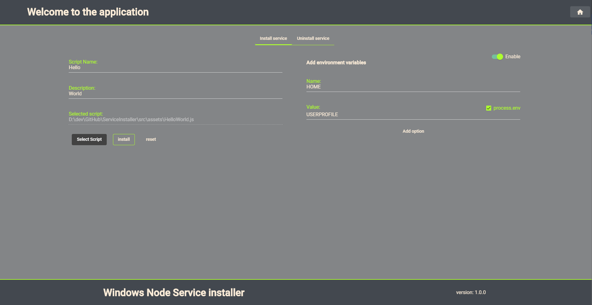
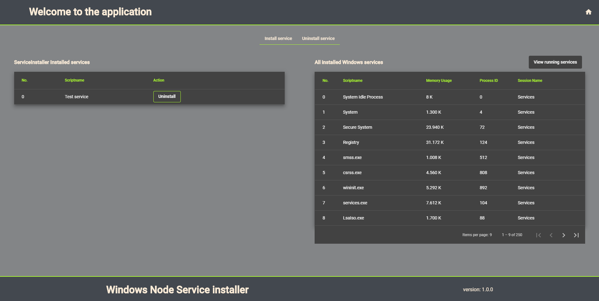

[](https://angular.io/) [](https://electronjs.org/)  
  
  [](https://creativesuite.visualstudio.com/GitHub/_build/latest?definitionId=4&branchName=master)

# Introduction

Gui for installing node service in windows. After install you will be able to monitor these servcies as any windows service.

## Installing

Enter name and Description  
Select a script and click Install  



Optional:  
  
Add Environment variables to your script.  
**enable** 'Add environment variables' function  
Enter name and value  

value can be a node proces.env, to activate this option check the process.env checkbox  
**click** add option  
You can add multiple environment variables at once.  

- Process.env value  
name: NODE_ENV  
**check process.env checkbox**  
value: USERPROFILE  
  
- Normal Value:  
name: NODE_ENV  
value: production      
  
will result in:  
-ex
```
env: [{
   name: "HOME",
   value: process.env["USERPROFILE"] // Access the user home directory
 },{
   name: "NODE_ENV",
   value: "production"
 }]
```


## Uninstalling

Click uninstall next to the script you want to uninstall or in case of windows service terminate




Currently runs with:

- Angular v8.1.3
- Electron v6.0.2
- Electron Builder v21.2.0

/!\ Angular 8.0 CLI needs Node 10.9 or later to work.

## Implemented projects
This project is based on the following projects  
  Core application  
    - [node-windows](https://github.com/coreybutler/node-windows)  
  Framework setup  
    - [angular-electron](https://github.com/maximegris/angular-electron)  
    
## Getting Started

Clone this repository locally :

``` bash
https://github.com/CreativeAcer/ServiceInstallerGUI.git
```

Install dependencies with npm :

``` bash
npm install
```

If you want to generate Angular components with Angular-cli , you **MUST** install `@angular/cli` in npm global context.
Please follow [Angular-cli documentation](https://github.com/angular/angular-cli) if you had installed a previous version of `angular-cli`.

``` bash
npm install -g @angular/cli
```

## To build for development

- **in a terminal window** -> npm run start


## Included Commands

|Command|Description|
|--|--|
|`npm run ng:serve:web`| Execute the app in the browser |
|`npm run build`| Build the app. Your built files are in the /dist folder. |
|`npm run build:prod`| Build the app with Angular aot. Your built files are in the /dist folder. |
|`npm run electron:local`| Builds your application and start electron
|`npm run electron:linux`| Builds your application and creates an app consumable on linux system |
|`npm run electron:windows`| On a Windows OS, builds your application and creates an app consumable in windows 32/64 bit systems |
|`npm run electron:mac`|  On a MAC OS, builds your application and generates a `.app` file of your application that can be run on Mac |

**Your application is optimised. Only /dist folder and node dependencies are included in the executable.**

## You want to use a specific lib (like rxjs) in electron main thread ?

You can do this! Just by importing your library in npm dependencies (not devDependencies) with `npm install --save`. It will be loaded by electron during build phase and added to the final package. Then use your library by importing it in `main.ts` file. Easy no ?

## Browser mode

Maybe you want to execute the application in the browser with hot reload ? You can do it with `npm run ng:serve:web`.
**Note that you can't use Electron or NodeJS native libraries in this case.** Please check `providers/electron.service.ts` to watch how conditional import of electron/Native libraries is done.

## Branch & Packages version
First version 1.0.0
